# anime_themes_player

A mobile application to play explore , search , manage and play anime theme songs. 

## Thanks to the community

Credits to Animethemes.moe and AnimeThemes community, Who has been maintaining Anime themes Database for a while now.

Many thanks also goes to Themes.moe who have provided mp3 mirrors of songs.

## Open Source Project

It is an opensource project I have developed Just for fun.

  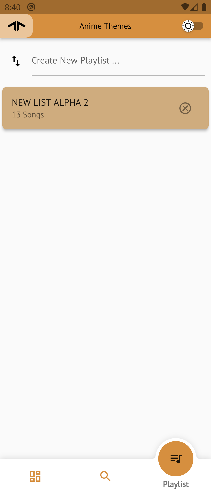
  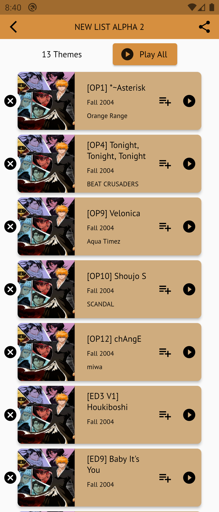
  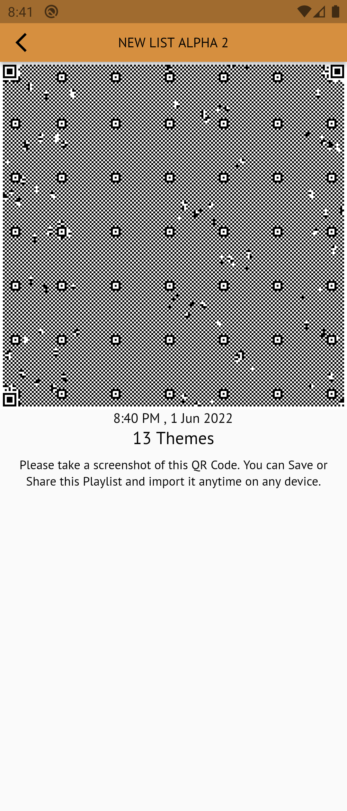
    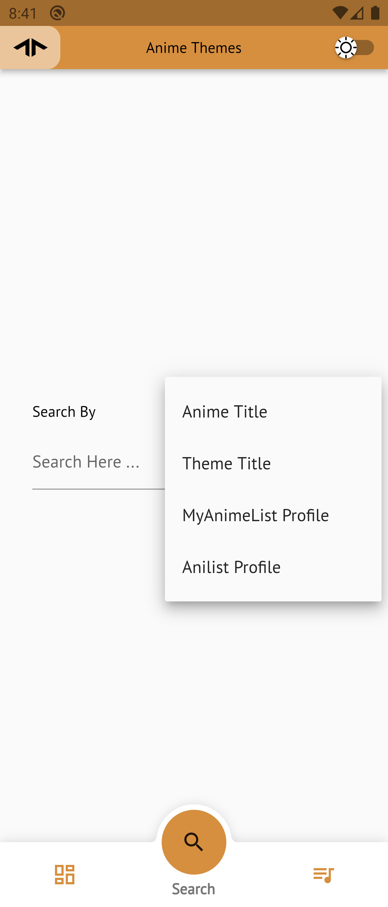
  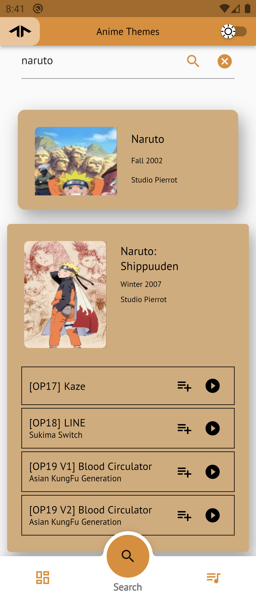
  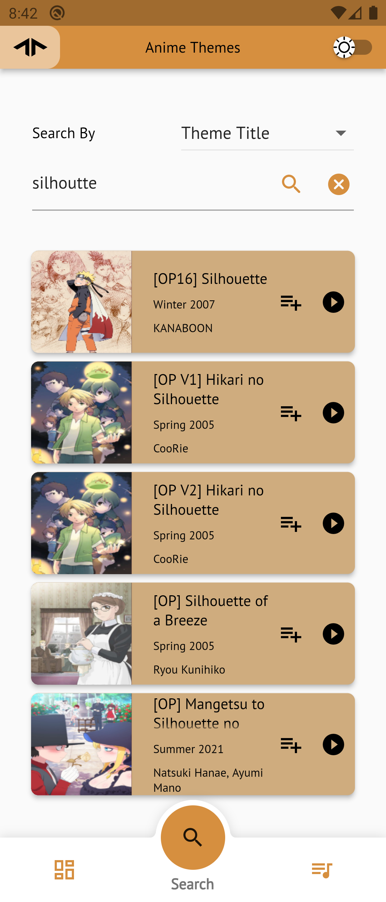
    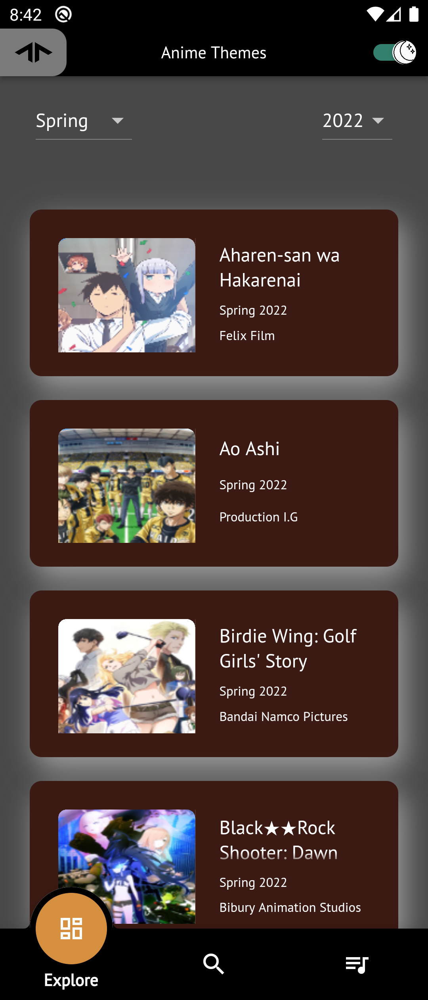
  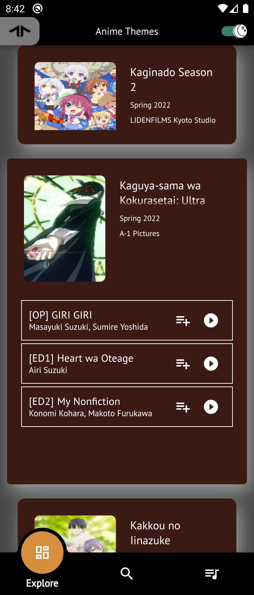
  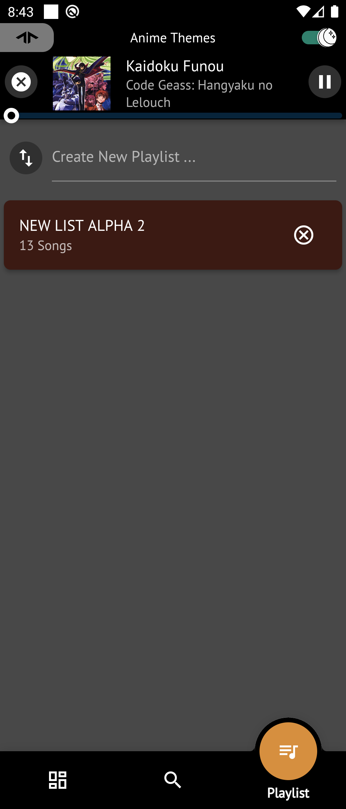
    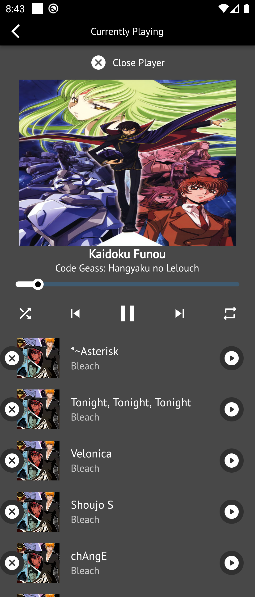
  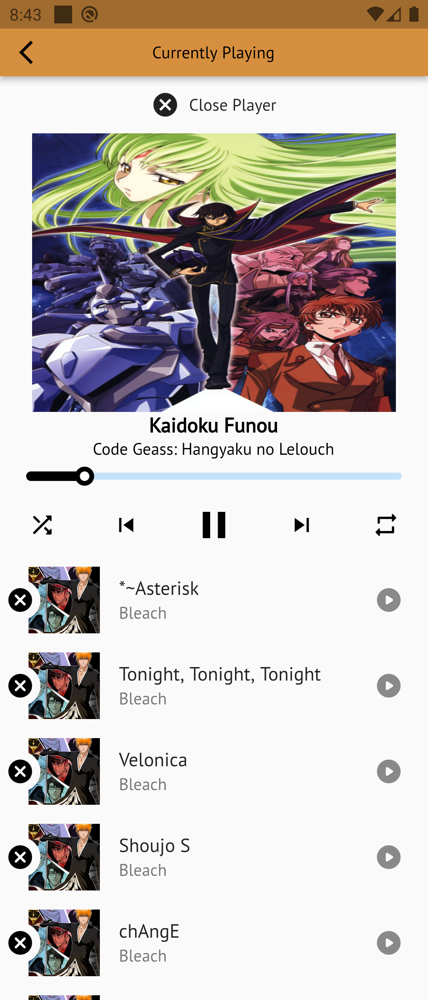

## Features

-> Search Anime From AnimeThemes.moe

-> Search Themes from AnimeThemes.moe

-> Search MyAnimelist Profile from Themes.moe

-> Search Anilist Profile from Themes.moe

-> Explore Seasons/Years

-> Save to Playlist

-> Add To queue

-> Can also in background

-> Tested on Android/iOS/macOS

-> seeking the current theme

-> playing whole playlist at once

-> Currently Playing Screen

-> Export/Import Playlist backup as QR Code

-> Play Video (Can switch between Audio only and video)

## Planned Features 

~~-> Allowing versions of themes to be added queue and playlists~~

-> maintenance